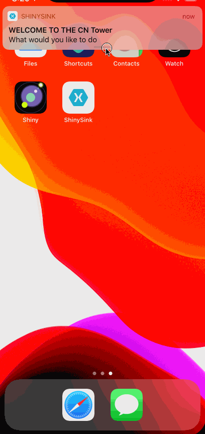

Title: Shiny 2.0 For Xamarin - Shinier Than Ever
Published: 5/5/2021
Image: images/shiny_logo.png
Tags:
    - Xamarin
    - OSS
    - Shiny
---

## TL;DR

Shiny is a Xamarin Framework designed to make dealing with device & background services easy by bringing things like dependency injection, logging, and lots of utilities to bring your workflows to the background
in friendly, testable, way!  

Version 2.0 is months of work, hundreds of commits, and a lot of discovery around how to improve the end experience.  This release focused on improving the background experience
even more especially on Android.  Android is the source of great pain when it comes to backgrounding and especially around expectations that people
have (for instance, real time background GPS).  As such, Shiny now uses foreground services in most of these places.  As a developer using Shiny, this is completely 
transparent change for you unless you want to customize the notification.

Now that I'm done with the boring rant.  Let's talk about some of the cool new features

* <a href="#death-to-boilerplate-code">Boilerplate Code</a>
* <a href="#static-class-generation">Static Class Generation</a>
* <a href="#logging">Microsoft Extensions Logging</a>
* <a href="#bluetooth-le">BluetoothLE</a>
* <a href="#notifications">Local Notifications</a>
* <a href="#push-notifications">Push Notifications</a>
* <a href="#beacons">Beacons</a>


## Death to Boilerplate Code
---
This was the first source of support pain and issues that users had was usually missed (or wrong) setup.  In 2.0, I set out for how to remove this issue.  With the latest C#/.NET5 release,
source generators were released.  This allows for code to be injected in the places Shiny needed it.  To make things even more convenient for users, I can also wire up all of their 
Xamarin Forms, Xamarin Essentials, and other 3rd party source code.

To get an idea, here is a before and after showing both iOS and Android boilerplate

<?# TabGroup ?>
<?*
tabs:
  - name: Android Before
    include: "../../includes/shiny20/androidbefore.md"

  - name: Android After
    include: "../../includes/shiny20/androidafter.md"

  - name: iOS Before
    include: "../../includes/shiny20/iosbefore.md"

  - name: iOS After
    include: "../../includes/shiny20/iosafter.md"
?>
<?#/ TabGroup ?>

To get this "voodoo" magic.  Simply install the <?# NugetShield "Shiny" /?> nuget package.  It's new with 2.0 and add the attribute shown above in "after".

## Static Class Generation
---
There are a lot of users that don't like dependency injection.  I can't see or live in a world without it (for now).  Not all users like dependency injection and I don't want to maintain static classes of everything.
With those thoughts in mind, source generators once again came to the rescue.  All you need to do is install the <?! NugetShield "Shiny" /?> in the library where you want the classes generated and add the attribute in any file as shown below.
For any Shiny library you have installed in your library, the source generator will create a static equivalent class of the interface.

```csharp
[assembly: StaticClasses("ILikeStatics")]

// core jobs
ILikeStatics.ShinyJobs.Register(...);

// ble
ILikeStatics.ShinyBle.Scan();

```

Pretty statics and NO dependency injection to be seen anywhere.


## Logging
---
Logging is generally something you want in your app.  When you work in the background, you can't rely on the general dev experience of hoping the errors in your VS output window.  
While libraries like AppCenter and Firebase help with crashes, it can be quite dangerous to build them directly into all of your views/viewmodels/classes/etc. Logging providers also tend to disappear and change over time.

With that being said, I also didn't want to write new providers to plugin into Shiny.  There was an easy answer to this problem - Use Microsoft.Extensions.Logging - the exact same library used by ASP.NET Core devs!  It is a fantastical abstraction 
to build on and support DI out of the gate!  The only thing that was missing was logging providers for AppCenter & Firebase - so I've added the following libs to Shiny

<?# NugetShield "Shiny.Logging.Firebase" /?>
<?# NugetShield "Shiny.Logging.AppCenter" /?>


Wiring providers up is also almost just like ASP.NET Core.  In your Shiny startup file:

```csharp
using System;
using Shiny;
using Microsoft.Extensions.DependencyInjection;
using Microsoft.Extensions.Logging;


namespace YourApp
{
    public class YourStartup : ShinyStartup
    {
        public override void ConfigureLogging(ILoggingBuilder builder, IPlatform platform)
        {
			builder.AddConsole();

			builder.AddFirebase();
			builder.AddAppCenter("your appcenter key");
        }
	}
}

```


## Notifications
---
Notifications had to undergo some changes to make sure things like sounds worked and response actions from notifications were consistent across platforms, thus, channels were 
created as to play ball properly with channels on Android and to a far lesser degree, categories on iOS.  

Channels are essentially configuration groups.  This provides equivalent functionality to what you find on Android 8+ such as
* Priority
* Sounds
* Actions - Text Replies, Buttons, etc

With iOS, "channels" equate in a way to categories, but apply more to the available actions on a given notification.  With that in mind, I had to bring these two
worlds together for a consistent design between them (oh... and that UWP thing can come along too).  What's better, channel is required on Android - if you don't care 
about the additional functionality - omit it and Shiny will default it for you!


```cs
var manager = ShinyHost.Resolve<INotificationManager>(); // INJECT THIS
await manager.AddChannel(new Channel 
{
	Identifier = "YourChannelName",
	Description = "This is your channel",
	Importance = ChannelImportance.Normal // normal+ will add default sounds on android
	CustomSoundPath = "notification.mp3",
	Actions =
	{
		new ChannelAction
		{
			Identifier = "message",
			Title = "Leave a Message",
			ActionType = ChannelActionType.TextReply
		},
		new ChannelAction
		{
			Identifier = "freeticket",
			Title = "Free Ticket",
			ActionType = ChannelActionType.Destructive
		}
	}
});

// BONUS - got a resource file that you want to use instead - make sure to call this before AddChannel
channel.SetSoundFromEmbeddedResource(this.GetType().Assembly, "Samples.Resources.notification.mp3");


// now to use it
await manager.Send(
	"WELCOME TO THE CN Tower",
	"What would you like to do?",
	"YourChannelName"
)

```

Which gives you this!




## Push Notifications
---
Since the mobile era began, I can't count on two hands how many push notification service providers I've seen come and go.  AppCenter, HockeyApp

Currently, Shiny is working with Native, Google Firebase Messaging, and Azure Push Notification Hubs.  
* Push
* Firebase
* Azure Notification Hubs
* OneSignal & AWS is in the works

Why is this such an awesome API? Because you can swap between 
push notification providers with 1 single line of code:

<?! Startup ?>
				// NATIVE
				services.UsePush<MyPushDelegate>(); // native
       
				// OR FIREBASE 
				services.UseFirebaseMessaging<MyPushDelegate>();

				// OR AZURE NOTIFICATION HUBS
				services.UsePushAzureNotificationHubs<MyPushDelegate>(
					"Your Listener Connection String",
					"Your Hub Name"
				);
<?!/ Startup ?>

This doesn't cover the general push setup like the Info/Entitlements.plist setup and google-services.json

Now that we've wired it up, let's request the user permission and get a token.

```csharp
var result = await ShinyHost.Resolve<Shiny.Push.IPushManager>.RequestAccess();
if (result.Status == Shiny.AccessState.Available) 
{
    result.RegistrationToken; // maybe you want to send this to your server to use in notifications
}


```

And lastly, how you actually get "pushes"

***Foreground***

```csharp
var subscription = ShinyHost
	.Resolve<Shiny.Push.IPushManager>()
	.WhenReceived(push => {
		var value = push.Data["ThisIsADictionary"];
		var title = push.Notification?.Title; // warning: notifications can be null
	});

// make sure to dispose when you're done or going to the background
subscription.Dispose();
```

***Background (this still runs in the foreground)***
<?! IncludeCode "../../CodeSamples/MyPushDelegate.cs" /?> 


### Tag Support
Tags are a way of telling the push provider (if supported), I want to listen to these "topics".  This is supported by all of the 3rd party 
messaging systems like Firebase & Azure Notifications Hubs.

```csharp
// will not be null if supported
var tagPushManager = ShinyHost.Resolve<IPushManager>() as IPushTagSupport;
await tagPushManager.AddTag("YourTag");
await tagPushManager.RemoveTag("YourTag");
await tagPushManager.ClearTags();
await tagPushManager.SetTags("tag1", "tag2"); // remove tags that aren't present and add new tags
tagPushManager.RegisteredTags; // your current set of registered tags

// OR use the friendly extension methods off the push manager
var push = ShinyHost.Resolve<IPushManager>();
await push.TryAddTag(...);
await push.TryRemoveTag(...);
await push.TryClearTags(...);

```

## Bluetooth LE
---
I really went through all of the API calls this library had to offer.  

BLE is still firmly (and always will be) rooted in Reactive Extensions, but I wanted to make the APIs easier to consume for all users including myself.

#### Managed Scans
Scanning was riddled with potential issues
* maintaining a list of unique peripherals while still watching things like the RSSI and 
* synchronizing list updates to your UI
* Removing a device from the list that hasn't been heard in a specific time
<?# TabGroup ?>
<?*
tabs:
  - name: Before
    include: "../../includes/shiny20/blescanbefore.md"

  - name: After
    include: "../../includes/shiny20/blescanafter.md"
?>
<?#/ TabGroup ?>

#### Managed Peripheral
The problem with traditional peripheral managed is that with every connection, you had to rescan for all of the services and characteristics you had.  You also had to restore any notifications you had.
This was painful

<?# TabGroup ?>
<?*
tabs:
  - name: Before
    include: "../../includes/shiny20/bleperipheralbefore.md"

  - name: After
    include: "../../includes/shiny20/bleperipheralafter.md"
?>
<?#/ TabGroup ?>

## Beacons
---
Beacons aren't really new, but there has always been a bit of a gap here in the Xamarin community.  You also had to always count on the beacon manufacturer supplying an SDK.
With Shiny, you get iBeacon (yes the Apple Beacons) out of the box on all of the platforms Shiny supports.  The thing I love about this library is that it is 100% C# and supports all of the monitoring/background scenarios
on Android as well!

#### Using Beacons

#### Managed Scan
This essentially works identical to the BLE managed scan.  
* It will remove beacons from your list that haven't been "heard" in a configurable timestamp

<?# TabGroup ?>
<?*
tabs:
  - name: Before
    include: "../../includes/shiny20/beaconscanbefore.md"

  - name: After
    include: "../../includes/shiny20/beaconscanafter.md"
?>
<?#/ TabGroup ?>

## LINKS
* <?# ConfiguredLink "Documentation" /?>
* <?# ConfiguredLink "Samples" /?>
* <?# ConfiguredLink "GitHub" /?>
* <?# ConfiguredLink "AllNugets" /?>